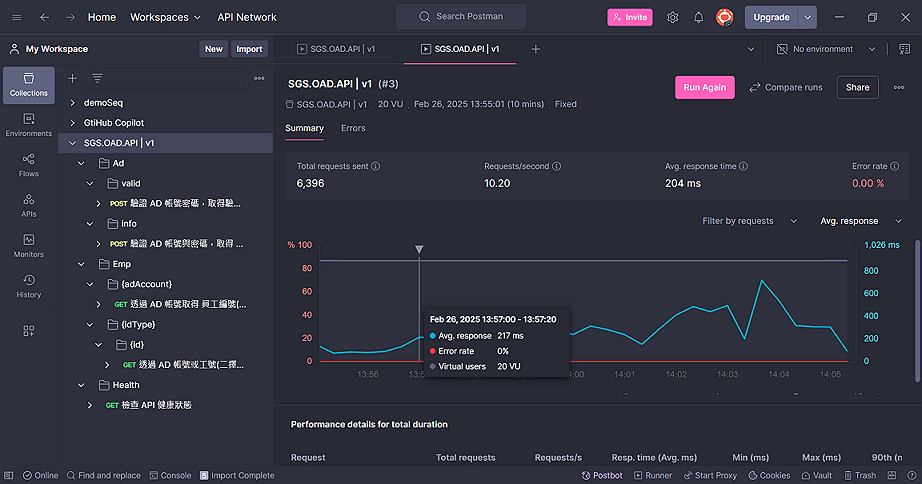
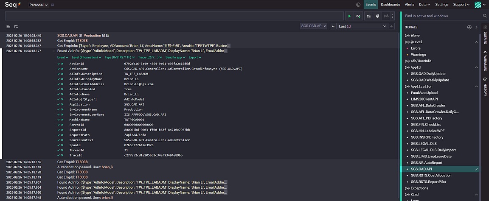

 
 


# 🌍 SGS.OAD.API

- ASP.NET Core 9 WebAPI，遵循 RESTful
- 提供 AD 驗證與獲取 HR 開放資料端點
- 提供 API 健康狀態檢查端點

# 🌳 Architecture

```js
📁SGS.OAD.API
  📁Controller  //--- api endpoints
  📁Models      //--- data structures
  📄appsettings.json
  📄appsettings.Development.json  //--- develop settings
  📄appsettings.Production.json   //--- production settings
📄README.md     //--- this doc
📄nuget.config  //--- internal package source
```

- 採用 Controller，非 Minium API
- `nuget.config` 定義了內部 NuGet pacakage source
- ⚠️部署時需確認<small>(或修改)</small> `appsettings.Production.json` 之 Base URL

# 🌐 UAT

https://twtpeoad001.sgs.net/api/scalar/


> 💡使用 [Scalar](https://scalar.com/) 作為測試介面

# 📌 Endpoints

- 詳細 API 規格請參考上述 [UAT 連結](https://twtpeoad001.sgs.net/api/scalar/)
- 可線上測試，並包含多種語言範例

## 🔐 Ad

透過 AD 帳號與密碼進行驗證，並可取得部分 AD 資訊

```
/Ad/vaild
```

- 因包含敏感資料，故設計為 `POST`，避免密碼直接暴露於網誌

```
/Ad/info
```

- 補充說明同上，此 API 可取得部分 AD 資料 <small>(不含工號)</small>

>🚨 `2024.12` 起 AD 之 `EmployeeId` 已非台灣工號，故不再提供，請搭配以下 `Emp` 端點取用

## 🧑‍💼 Emp

使用 AD 帳號取得工號或公司內開放員工資料 <small>(不含個資)</small>

```
/emp/{adAccount}
```

- 取用資料且不含敏感資訊，故設計為 `GET`

```
/emp/{idType}/{id}
```

- 補充說明同上，另 `{idTyle}` 支援 AD 帳號 `0` 與 工號 `1`

## 🩺 Health

```
/health
```

- 嘗試實作簡單的健康狀態檢查，可取得目前 API 狀態

# 📦 Dependency

- [SGS.OAD.AdAuth](http://twoadcode:3000/brian_li/SGS.OAD.AdAuth)，AD 相關套件，包含驗證與取得部分 AD 資料
- [SGS.OAD.HrInfo](http://twoadcode:3000/brian_li/SGS.OAD.HrInfo)，可取得 HR 開放之員工資料 <small>(不含個資)</small>

>💡如開發 .NET 專案 <small>(且目標框架支援)</small>，可直接使用上述套件即可

# 🧪 Test

使用 Postman 進行簡單壓力測試，測試報告 [請點此](./assets/report.pdf)



# 📜 Log

已接入內部 Seq



# 📚 Reference

- [ASP.NET Core 中的健康狀態檢查](https://learn.microsoft.com/zh-tw/aspnet/core/host-and-deploy/health-checks)
- [Scalar](https://scalar.com/)
- [Postman](https://www.postman.com/)
- [Seq](https://datalust.co/seq)